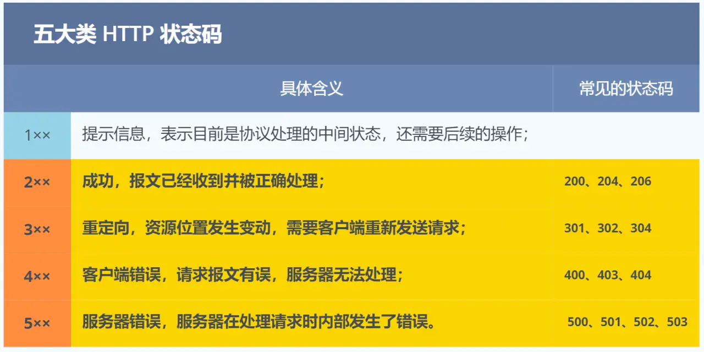

# 概述

## TCP/IP网络模型

同一台设备的不同进程：管道、消息队列、共享内存、信号等方式；  
不同设备之间通信：网络协议

七层网络模型：
- 应用层：专注为用户提供应用功能，不用考虑传输；
  - 应用层工作在用户态，而其余层工作在内核态（计算机与“外部”通信是靠I/O实现的）
- 传输层：TCP/UDP、报文段、端口
- 网络层：IP、分片、地址划分、路由
- 链路层：数据帧、以太网、MAC、差错检验
- 物理层：在实际应用中，后两层可看做**网络接口层**。

## 经典样例：网址键入到网页显示

1. 解析URL：URL记录了一个资源在网络空间中的地址；
2. 生成HTTP请求：将“请求URL”的行为封装成HTTP报文（应用层）；
3. DNS解析：解析域名的IP地址；
4. 生成TCP报文：分段、格式、三次握手、四次挥手；
5. 网络传输：
   - IP：路由协议、前缀匹配、特殊地址
    - MAC：帧格式
    - 协助协议：TCMP、ARP
6. 交换机、路由器

## Linux系统

Linux按照四层协议模型（应用、传输、网络、接口）。

网卡是专门负责收发网络包的I/O硬件，通常使用DMA技术，将网络包写入内存。

Linux 2.6内核中引入**NAPI机制**，中断幻象数据处理程序，然后使用poll方法轮询数据。  
处理程序从内存取出数据帧后，逐层检查数据/解析封装，最后将应用层数据放入socket接口中。
- 应用从Socket读取或放入Scocket时，都使用“拷贝”，而不是直接交付，因为网络收发可能出现错误，有些协议可能会要求重发。
- 一共会发生**三次**拷贝，第一次发生在系统调用，应用数据被拷贝到sk_buff中；第二次发生在TCP->IP，确保可靠传输；第三次在IP分片，如果过sk_buff过大，会拷贝被分割为多个小的sk_buff。
- 使用sk_buff一个结构体，可以描述所有不同层的数据包结构（报文段、片、帧），这是因为sk_buff中设置“head、data、tail、end”四个指针，用于描述不同层次封装的数据包。

# HTTP

HTTP是最经典的应用层协议，在面试中常常会有考察，以下总结一些常见的面试题目。

## 基本概念

HTTP（HyperText Transfer Protocol，超文本传输协议），在互联网中规定计算机之间传输超文本数据的规范，以及相关的各种控制和错误处理方式。
- 超文本：文字、图片、视频、超链接的混合体，需要使用浏览器解释。

## 常见状态码

## 常见字段

- Host：表示服务器的域名
- Content-Length：数据长度；
- Content/Accept-Type：本次发送/请求可接受的数据格式；
  - */*：任意数据格式；
  - text/html；Charset=utf-8：utf-8编码的网页；
- Content/Accept-Encoding：本次发送/请求可接受的数据字段压缩方法；
- Connection：客户端要求服务器使用“持续HTTP”机制（HTTP/1.1）；
  - 区分TCP Keepalive 和 HTTP Keep-Alive：
    - 实现层级不同，HTTP在应用层，用户态实现；TCP属于传输层，由内核实现；
    - HTTP Keep-Alive 用于复用TCP；TCP的Keepalive为保活机制。

## GET、POST的区别

根据**RFC规范**，**GET**语义为从服务器获取指定的资源；POST语义是根据请求报文内容对指定资源做出处理。
- GET请求的参数位置一般写在URL中，URL只支持ASCII，因此GET只能请求ASCII字符，且浏览器会对URL长度有限制（HTTP本身没有限制）
- POST请求的参数位置一般写在报文body中，body报文可以是任意格式，且浏览器不会对body大小进行限制。

**安全性和幂等性**，所谓“安全”，即是请求方法不会**破坏**服务器上的资源；所谓“幂等”，就是多次执行相同的操作，结果**相同**。
- GET方法安全且幂等；因为它只会读取服务器上的内容；
- POST则既不安全，也不幂等。

但实际开发中，开发者不一定按照RFC规范实现以上方法，这就要具体情况具体分析了。

值得一提，如果安全指的是信息泄露，那么HTTP本身就是不安全的，因为它的传输是明文的。

GET请求可以带body吗？ 理论上，任何请求都可以带body。

## HTTP缓存

将“请求-响应”数据对缓存在本地，减少HTTP请求，提升性能。HTTP缓存由两种实现方式：**强制缓存**和**协商缓存**。

强制缓存：只要缓存未过期，这直接使用本地缓存，决定是否使用缓存的主动性在浏览器。强制缓存利用响应头中的“Cache-Control、Expires”字段实现，前者是相对时间，后者为绝对时间，两个字段同时存在时，相对时间优先级更高。

协商缓存：服务器判断是否使用缓存，如果可以，则使用304状态码告知浏览器。协商缓存有两种实现方式：
- 响应头部的“Last-Modified”字段，标示这个响应资源的最后修改时间；请求头部的“If-Modified-Since”字段，若请求中带有该字段，则服务器比较修改时间，决定是否使用缓存；
- 响应头部的“Etag”字段，唯一标识响应资源；请求头部的“If-None-Match”，如果请求带有该头，则服务器比对标示值，决定是否使用缓存。

两种实现方式中，第二种更加可靠，优先级也更高，原因如下：
1. 文件修改时间变化与文件内容变化并不具有强关联，可能修改时间变化了，但文件内容并没有变化；
2. If-Modified-Since时间粒度为秒，如果在秒以内发生修改，可能无法识别；
3. 部分服务器不支持文件修改时间获取。

强制缓存与协商缓存是两种实现方法，但通常配合使用：强制缓存中的内容过期时，才会出发协商缓存。

## HTTP特性

常见的HTTP版本为HTTP/1.1、2.0、3.0，