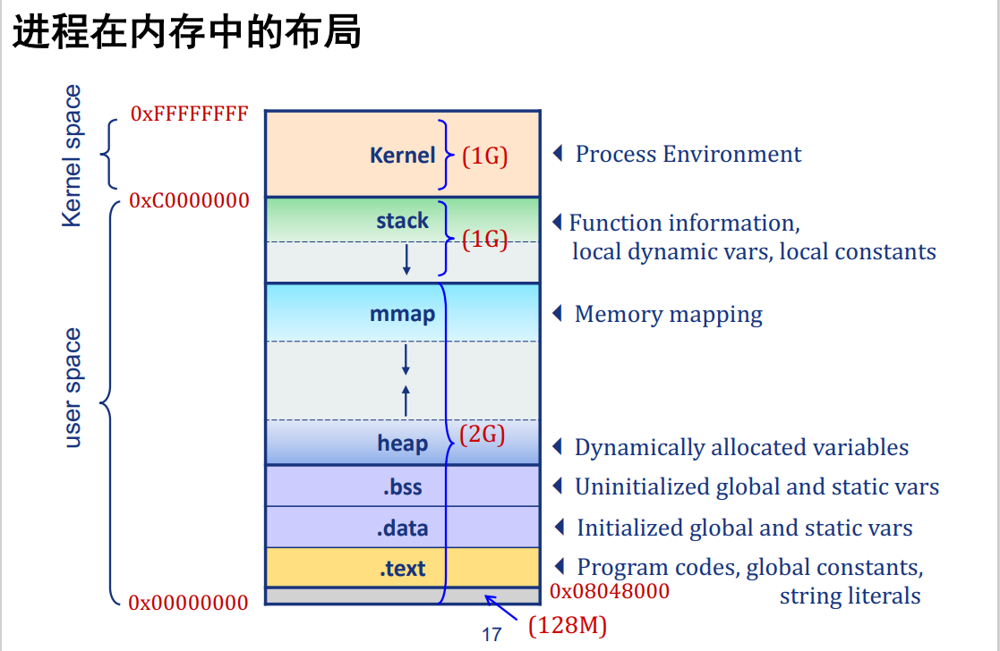

# 前言

内存管理与os、编程语言均有关，需要深入理解两者对内存管理的方式、方法，以及关联和区别。

# 操作系统层面

## 字节序


## 内存对齐


## 寻址&地址空间


## 

# C++内存管理

程序内存空间图：栈、堆、全局/静态区、常量区、二进制文件区



## 计算类大小

常见基础数据结构的大小：
```cpp
sizeof(bool) = 1;   sizeof(char) = 1;
sizeof(short) = 2;  sizeof(int) = 4;
sizeof(long) = 4;   sizeof(long long) = 8;
sizeof(float) = 4;  sizeof(double) = 8
sizeof(void*) = 4(32bits)/8(64bits);
```

类的大小**至少等于**所有非静态数据成员的大小和，但由于字节对齐，可能会大于大小和。
- 字节对齐：类存储时，往往以类中最长的基础数据类型长度为单位补全其它数据类型；
- 继承：计算派生类的大小时，需要考虑其父类的数据成员。

特殊类成员的大小：
```cpp
class A{};  sizeof(A) = 1;
// 类大小至少为1，避免不同实例有相同地址
class A {virtual F() {}}; sizeof(A) = sizeof(void*);
// 虚函数有指向虚函数表的指针
class A {static int a;}; sizeof(A) = 1;
class A {static int a; int b;}; sizeof(A) = 4;
class A {void fun() {};};   sizeof(A) = 1;
// 静态数据、成员函数（包括重载）不存放在类中
```

> 为什么要进行字节对齐？
> 1. 加快存储效率：一般硬件可以一次性取出I/O总线宽度的数据，如果数据处于两个不同的块，可能需要两次存取；
> 2. 避免跨页内存；
> 3. 加速访问：结构体内部查找变量时，按照固定的长度移动指针，不需要额外计算。

# 联系与区别
